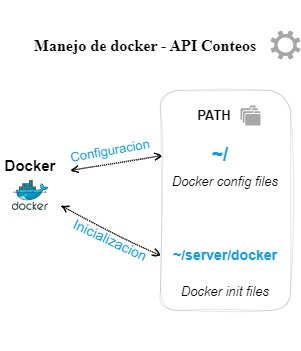

# API de conteos ⚙️

_Esta API es utilizada en el backend del software ceranalytics para apoyar las tareas de conteos por planta en los huertos que corresponden a cada cliente._

## Comenzando 🚀

_A continuacion encontraras los aspectos que debes conocer de la API, asi como su funcionamiento y estructura general  ._


### Pre-requisitos 📋

_Para contribuir al desarrollo de la API, es imperativo que tengas las siguientes herramientas instaladas en tu equipo:_

* `<NodeJS>` : <https://nodejs.org/en/> <br>
*  `<GIT>` : <https://git-scm.com>

### Clonando el repositorio 🤖🔁

_Para poder contribuir al desarrollo de esta API es necesario que clones el repositorio en tu equipo local_

*  _Crea un directorio para almacenar y acceder al proyecto_

```
Click derecho/nueva_carpeta
```

* _Dentro del directorio abre la consola de GIT y escribe el siguiente comando_

```
git clone 'url_del_repositorio'
```

* _Finalmente abre el directorio desde el editor de codigo 
(VSCode recomendado) y ya podras navegar por la estructura de la API_

## Tecnologias utilizadas 🛠️

_Para el desarrollo de esta API se utilizó:_
* `<Nodejs>` : <https://nodejs.org/en/> <br>
* `<Reactjs>` : <https://reactjs.org> <br>
* `<Expressjs>` : <https://expressjs.com/es/> <br>
* `<MongoDB>` : <https://www.mongodb.com>

### Estructura de la API 🪵

_La API esta desarrollada bajo la arquitectura REST  y apoya las tareas requeridas por la seccion de conteos dentro de la plataforma analytics (<https://plataforma.staging.ceranalytics.cl/counting>) . La estructura de los directorios se basa en MVC_


### Descripcion general directorios 📑

_Una descripcion general de los directorios en el proyecto y su funcionamiento_

| PATH | Contenido  | Cometido |
| :------------ |:---------------:| -----:|
| /      | Configuracion de docker | Despliegue |
| /server/docker      |  Inicializacion de docker        |   Despliegue |
| /server/src | Comunicacion con la base de datos, administracion de credenciales, controladores y rutas REST       |    Manejo, tratamiento, y desponibilizacion de los datos al cliente |
| /server/src/common      | Decreto de codigos de error para Discord | Establecimiento de errores comunes para ser registrados en servidor de discord mediante un bot  |
| /server/src/config     | Instancia del cliente GCP y constantes | Establecimiento de constantes e instancia GCP para el tratamiento futuro de los datos  |
| /server/src/controllers     | Controladores de la API | Consultas, filtrado, operaciones y disponibilizacion de los datos. Integracion de Discord y testeo de la API |
| /server/src/db     | Comunicacion con la base de datos| Inicializa una conexion con la base de datos  |
| /server/src/model   | Tipificacion de colecciones mongo| Establece la tipificacion de los documentos a obtener de las colecciones en mongo utilizadas en esta API  |
| /server/src/routes    | Paths REST | Establece las rutas REST para la disponibilizacion de los datos al cliente final |
| /server/src/secure    | Manejo de credenciales | Inicializa constantes con las credenciales necesarias para la comunicacion con el servidor  |
| /server/src/utils   | Utilidades de desarrollo | Establece parametros generales para la plataforma, asi como scritpts para el manejo de errores y comunicacion con el servidor  |

### Comunicacion entre artefactos 📞
</img>

### Paths REST 🗺️
| HTTP Request| Path  | Accion |
| :------------ |:---------------:| -----:|
| GET     | "/counter" | Retorno datos conteo generales |
| GET     | "/counter-type" | Retorno datos conteo (segun parametro)|
| GET     |"/counter-count"| Retorno datos procesados |
| GET     |"/plant-count" | Retorno conteo plantas |
## Autores ✒️

* **Equipo CER** - *Desarrollo y levantamiento de la API * - [tianalyticschile](https://github.com/tianalyticschile)
* **Diego** - *Documentación* - [XP-Magician](#https://github.com/XP-Magician)

También puedes mirar la lista de todos los [contribuyentes](https://github.com/your/project/contributors) quíenes han participado en este proyecto. 
